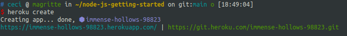
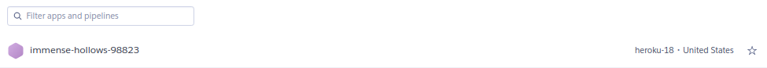

## Ejercicio 2

Crear una aplicación en OpenShift o en algún otro PaaS en el que se haya dado uno de alta. Realizar un despliegue de 
prueba usando alguno de los ejemplos incluidos con el PaaS.

En heroku vemos la app:

Se puede acceder a través de la url: https://immense-hollows-98823.herokuapp.com/