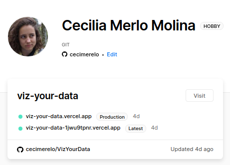
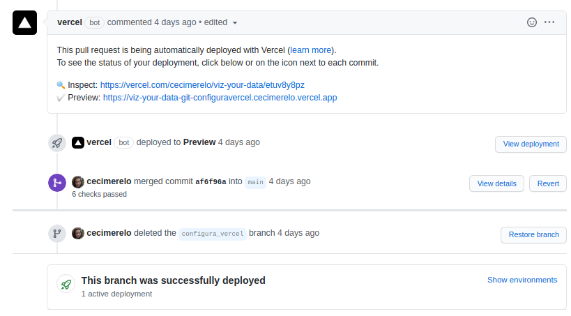
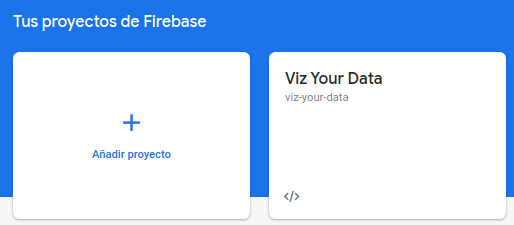
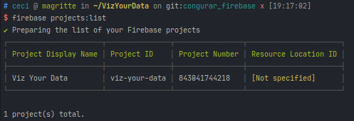

## Darse de alta en Vercel

Además está hosteando mi app, podemos verla en el siguiente [enlace](https://viz-your-data.cecimerelo.vercel.app/). En
el [PR](https://github.com/cecimerelo/VizYourData/pull/41) donde se ha configurado Vercel se ha tenido que añadir
algunos cambios para que se pudiera desplegar correctamente. Pero ahora para cada PR aparece lo siguiente:

Lo que nos indica si el despliegue se ha realizado correctamente o no, además de indicarnos que la configuración se ha
realizado correctamente.

## Darse de alta en Firebase

Damos de alta nuestro proyecto en Firebase:

Agregar el SDK, con la orden `npm install firebase-admin --save`

Instalamos la CLI y ejecutamos `firebase init`. Entonces tendremos que seleccionar los servicios de los que queremos 
hacer uso y ya estaría.

