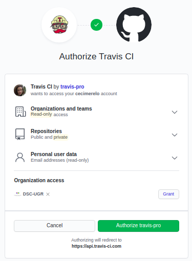
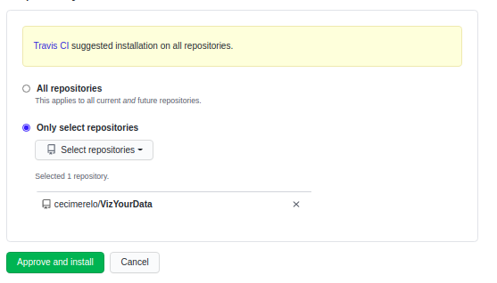
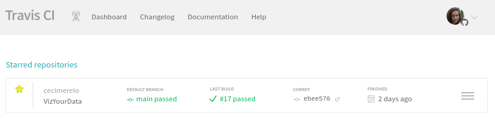

### Ejercicio 9
1. Darse de alta en Travis
    
    
    
2. Activar el repositorio en el que se vaya a aplicar la integración continua.

    
    
    
### Ejercicio 10

Hemos configurado Travis para usar en nuestra app.

